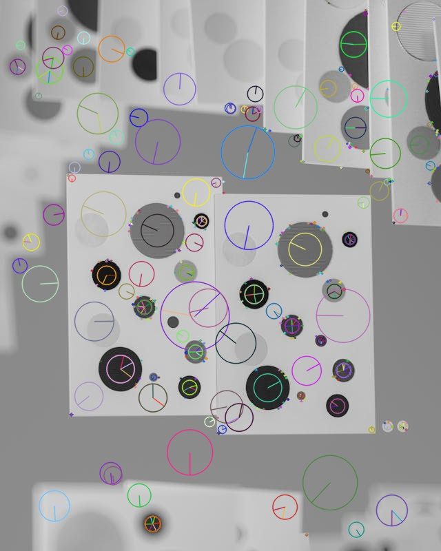
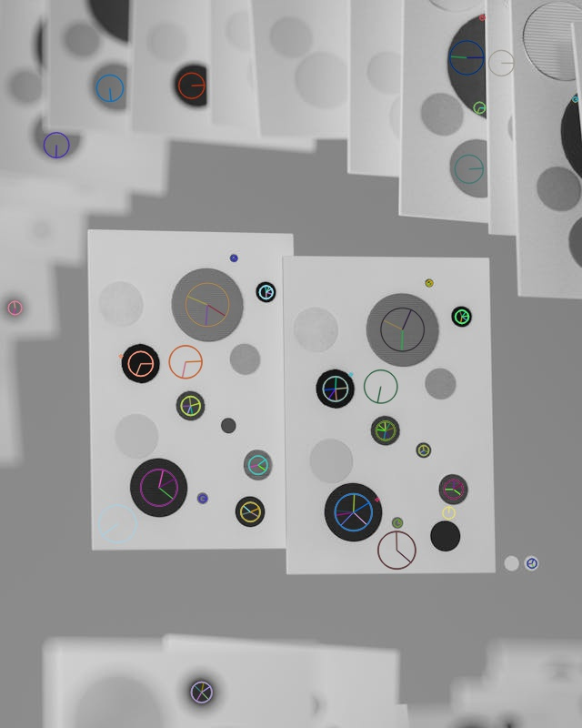

# Feature Detection

## Blob Detection &mdash; *Part 1*

### Plot



### Analysis

Using OpenCV’s `cv.SIFT_create()`, the detector identifies distinct image regions based on local contrast and edge strength. Each keypoint is drawn as a scale-proportional circle whose diameter reflects the size of the detected feature. In the default configuration (`contrastThreshold = 0.04`, `sigma = 1.6`), SIFT detects **384 keypoints**, primarily clustered around the edges of the circular blobs where gradient changes are strongest.

---

## Tuning blob detection performance &mdash; *Part 2*

### Plot &mdash; tuned parameters


### Analysis

After adjusting detector parameters to

```python
sift = cv.SIFT_create(
    nfeatures=0,
    contrastThreshold=0.0999,
    edgeThreshold=20,
    sigma=3,
    nOctaveLayers=3)
```

The detector produced **108 keypoints**. Raising `contrastThreshold` reduces spurious detections by filtering out very low-contrast regions, while the moderate `sigma` smooths the image to stabilize scale detection. The result is a more selective set of keypoints that better correspond to visually salient circular blobs, minimizing redundant detections along smooth edges. This tuning highlights how SIFT’s thresholds balance sensitivity (number of detections) against robustness (quality of features).

---

## Descriptors &mdash; *Part 3*

### Visualization


### Analysis

Each SIFT descriptor encodes the gradient structure around one keypoint as a **128-dimensional vector** formed from a **4 × 4 grid** of cells, each with an **8-bin orientation histogram**.

* **Spatial cells (4×4)** preserve coarse layout within the keypoint’s local patch.
* **Orientation bins (8 per cell)** capture how image gradients are distributed between 0° and 315°.
* High histogram values (e.g., 100–118) indicate strong, consistent edge directions; near-zero bins represent flat or low-contrast regions.

In the black-circle test image, outer cells show dominant orientations corresponding to the circle’s edge, while inner cells remain low—confirming that SIFT records edge direction and magnitude across space. The descriptor thus forms a compact, rotation- and scale-invariant “fingerprint” for matching features between images.

---

## Feature Matching &mdash; *Part 4*

### Plot


### Analysis

A rotated (25°) and scaled (0.8×) version of the original image (`image2`) was generated using `cv.warpAffine`. Running `sift.detectAndCompute()` on both images produced descriptors that were compared with OpenCV’s **Brute-Force Matcher** (`cv.BFMatcher(cv.NORM_L2, crossCheck=True)`).
After sorting matches by descriptor distance and retaining the top 50, many lines correctly connect corresponding dots between the two images. This demonstrates SIFT’s robustness to geometric transformations: by normalizing orientation and scale within each keypoint’s descriptor, SIFT successfully recognizes the same physical features despite rotation, scaling, and minor intensity differences.
