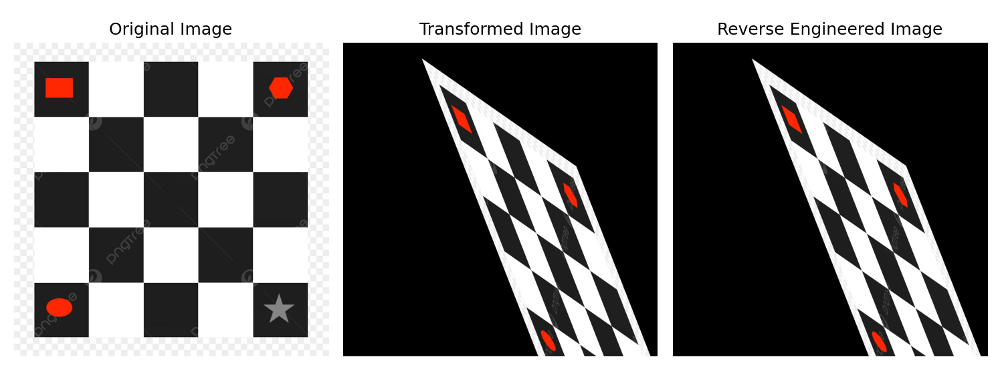
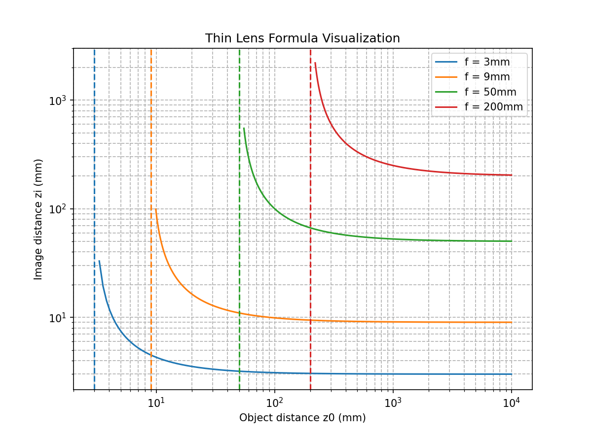
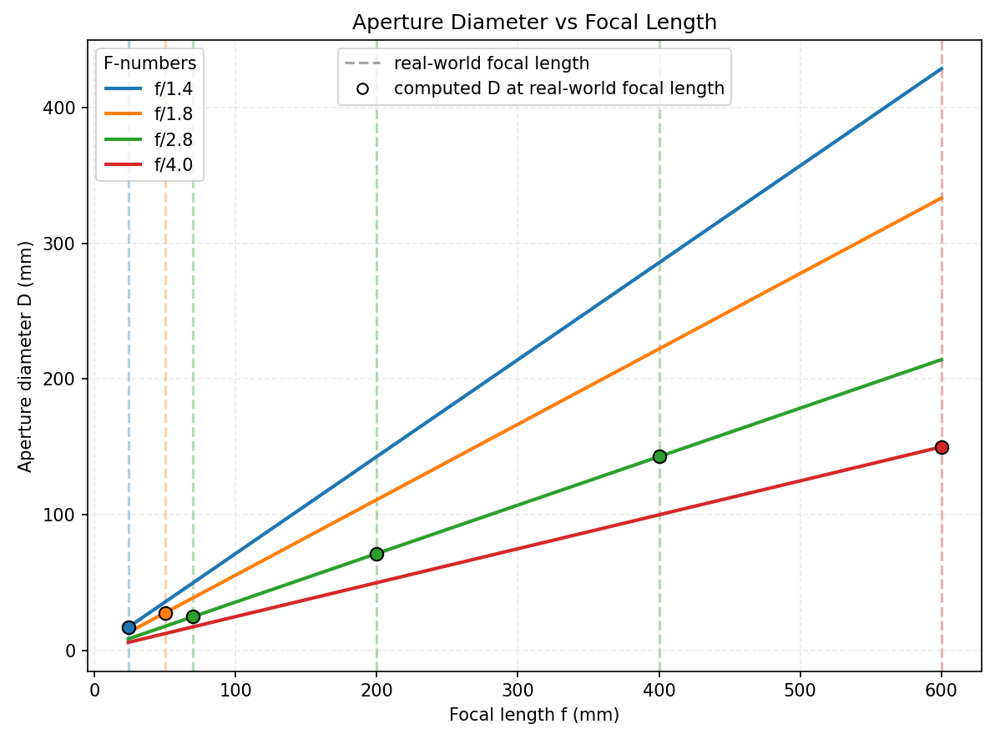
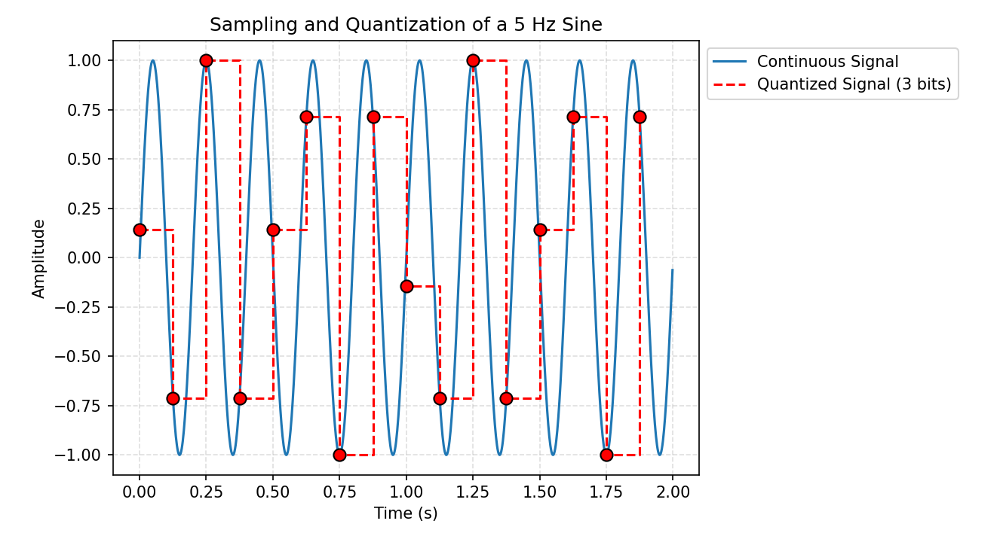
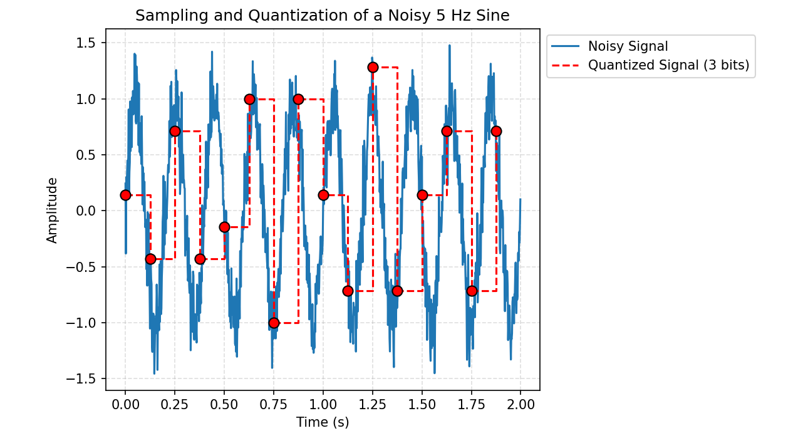

# **Image Formation &mdash; Computer Vision**

## **ASSIGNMENT 1**

## **Reverse Engineering 2D Transformations** &mdash; _Exercise 1_
### Plot

### Analysis
Using three point correspondences between the original board and the skewed board, we estimate a 2×3 affine matrix with `cv.getAffineTransform` and apply it via `cv.warpAffine`. The printed matrix decomposes into a translation (≈ +300 px in x, +60 px in y) and a mix of rotation, scaling, and shear. The visual result lines up well because an affine model preserves parallel lines, which is exactly what we see in the transformed board: edges stay parallel but squares become general parallelograms. If we had perspective effects (parellel lines converging), a projective transformation would be a better fit. Overall, this demo shows how picking a small set of reliable correspondences is enough to reproduce viewpoint-like warps of flat objects such as posters, pages, or checkerboards. It also shows the power of `OpenCV` and linear transformations in general to process and manipulate visual data.

## **Thin Lens Law and F-number Plots** &mdash; _Exercise 2_
### Plots
**Thins Lens Law**:

**F-Number**:

### Analysis
The thin-lens plot graphs $z_i$ vs. $z_0$ for several focal lengths using $\tfrac{1}{f}=\tfrac{1}{z_0}+\tfrac{1}{z_i}$. Each curve shoots upward near the vertical dashed line at $z_0=f$ because focusing an object placed at the focal plane would require $z_i$ to equal infinity (sensor at infinity). As $z_0$ increases beyond a few multiples of $f$, all curves flatten and $z_i$ approaches $f$. In the real world, this would mean that faraway scenes focus roughly one focal length behind the lens. Longer lenses yield larger $z_i$ for near objects.

The f-number figure plots the simple relation $D=\tfrac{f}{N}$. Lines of constant $N$ are straight with slope $1/N$. The marked real-world focal lengths (e.g., 70–200 mm at f/2.8) sit on their respective lines and illustrate how maintaining a small f-number at long focal lengths requires large/wide apertures. The ideal aperture widths for these real world focal lengths can be seen be observing the aperture diameter (y axis) at the points that sit on the lines. In practice that means larger, heavier lenses that gather more light and enable faster exposures; conversely, short-focal-length phone cameras can achieve bright apertures with small diameters.

## **Sampling and Quantization** &mdash; _Exercise 3_
### Plot

### Analysis
We generate a 5 Hz sine wave, sample it at $f_s=8$ Hz, and quantize to **3 bits** (8 levels). Two effects appear. First, the stair-step trace comes from rounding amplitudes to the nearest of 8 allowed values; that rounding error is the quantization noise. Second, because Nyquist-Shannon requires $f_s \ge 2 f_{\max}$ and we used 8 Hz, the samples cannot accurately recreate the original frequency, and we end up aliasing the signal. If we attempted to reconstruct the signal from these samples, we would not be able to fully recreate the original signal. According to Nyquist-Shannon, we would need a **sample frequency of at least 10 Hz** to be able to uniquely represent the signal through sampling. In imaging terms, when fine textures exceed the sensor’s spatial sampling rate, the camera isn't able to capture these fine textures in full detail. The main lesson that this plot shows is both adequate sampling rate and bit-depth matter: if both aren't sufficient, accurately capturing scenes through imaging systems is impossible.

## **Noise and Error Analysis** &mdash; _Exercise 4_
### Plot

### Analysis
We add zero-mean Gaussian noise to the signal before quantization and report $MSE$, $RMSE$, and $PSNR$ against the clean sampled sine. The noisy blue curve visibly deviates from the ideal waveform; after quantization, the red step function deviates even more. Numerically, MSE increases (so RMSE increases) and PSNR decreases when we go from “noise only” to “noise + quantization,” confirming that digitization compounds error already introduced by noise. Here is an example of the metrics that were output (outputs were variable due to randomness of the `add_gaussian_noise` function, but this is consistent with most outputs):
* **Noise only**:      $MSE=0.035122$  $RMSE=0.187410$  $PSNR=14.54 dB$
* **Noise + quant.**:  $MSE=0.040842$  $RMSE=0.202094$  $PSNR=13.89 dB$

These metrics provide a scale we can use to interpret error: lower MSE/RMSE or higher PSNR means the processed signal stays closer to the reference.

---

## **ASSIGNMENT 2**

