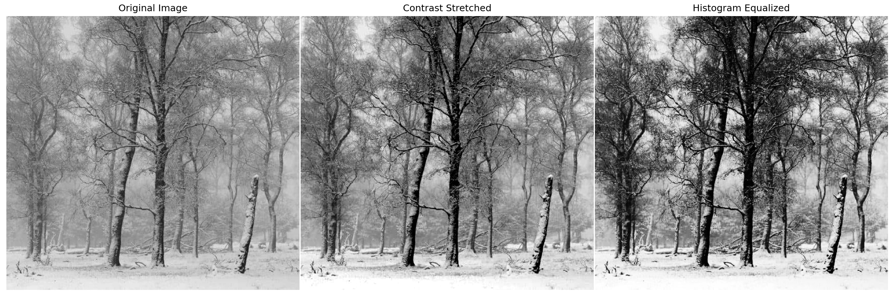
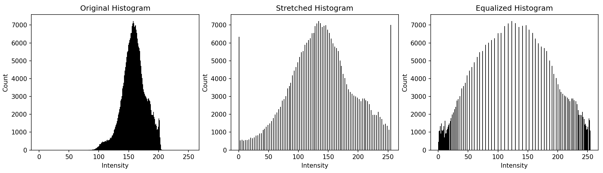
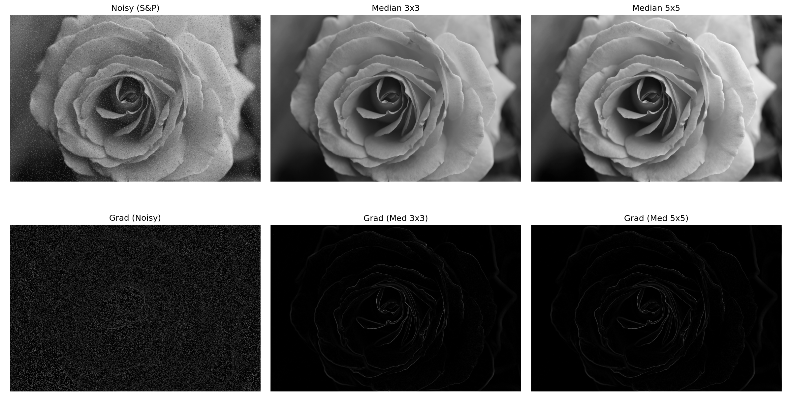
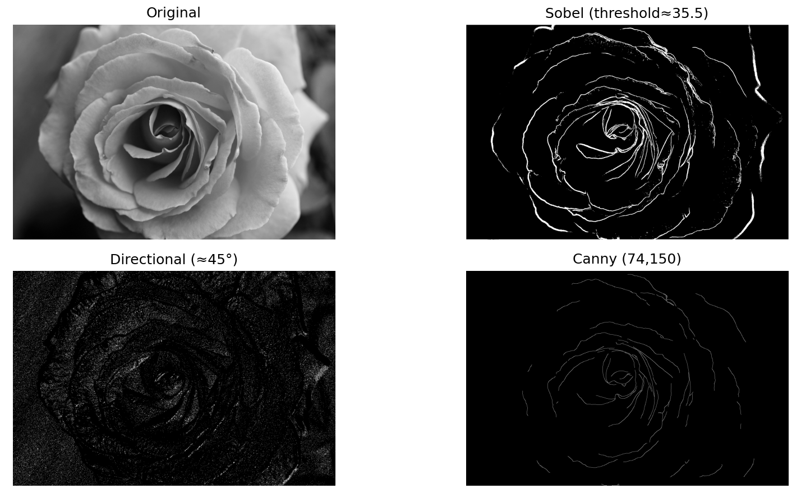

# Basic Image Processing

## Intensity Transformations and Histogram Equalization — *Exercise 1*
### Plots

### Analysis
This exercise focused on enhancing image contrast using two techniques: **contrast stretching** and **histogram equalization**. Both methods were applied to a low-contrast grayscale image, and their effects were compared visually and through their histograms.

**Contrast stretching** linearly remaps the intensity range $[r_{\min}, r_{\max}]$ to the full $[0, 255]$ range. If found that its effectiveness was highly dependent on choosing appropriate `r_min` and `r_max` values. Using the absolute min and max of the image produced weak results, since outliers made the stretch nearly imperceptible. After some experimentation, setting `r_min` and `r_max` to the 2nd and 98th percentiles respectively gave a strong improvement: the image displayed clear, realistic contrast without over-enhancement. The plotted histogram graph supports this finding: instensities are spread out much more evenly across the range, while large spikes appear at 0 and 255 as a result of clipping extreme values.

**Histogram equalization**, in contrast, produced a much more dramatic transformation. By redistributing pixel intensities according to the cumulative distribution, it created deeper blacks and reduced midtones, making the image appear higher in contrast but less natural. The histogram was significantly flattened, indicating a stronger nonlinear intensity redistribution. The plotted histogram graph confirms this. Intensities are much more distributed, but there are noticeable concentrations near 0 and 255, showing a strong nonlinear adjustment.

Overall, contrast stretching provided controlled, visually pleasing results when good percentile values were chosen, while histogram equalization offered more aggressive enhancement that may be useful in more general contexts, even if it produces harsher images

## Non-linear Filtering and Edge Detection &mdash; _Exercise 2_
### Plot

### Analysis
This exercise explored the effect of **median filtering** on images corrupted with **salt-and-pepper noise**, and how this impacts gradient-based edge detection using the Sobel operator. Salt-and-pepper noise introduces isolated black and white pixels, which produce large, spurious gradient responses across the image. This is clearly seen in the “Grad (Noisy)” plot, where the gradient magnitude shows speckled noise throughout the image rather than well-defined edges.

Applying a **median filter** with a $3 \times 3$ window removed most of these isolated noise spikes while preserving the main structural edges of the rose. As shown in the gradient plots, after median filtering the edge map becomes much cleaner and highlights only meaningful edges. A larger $5 \times 5$ median filter further reduces noise but slightly smooths fine edge details, as expected.

The effect is also clear quantitatively. For the **noisy image**, 1,979,961 pixels had nonzero gradient magnitude, with 95th and 99th percentile values of 86.0 and 113.0. After **median 3×3 filtering**, nonzero pixels dropped slightly to 1,924,233, and the 95th/99th percentiles dropped sharply to 11.0 and 35.0. With **median 5×5**, these values fell further to 1,776,670 (nonzero), 10.0 (95th), and 34.0 (99th).

Overall, the median filter does an very good job of suppressing random, salt and pepper noise without excessively blurring edges, leading to far cleaner and more reliable gradient magnitude computations.

## Simple Sobel-based Edge Detector
### Plot

### Analysis
The **Sobel edge detector**, using a threshold around the 95th percentile (~35.5), produced clean and well-defined edges around the rose petals. Some soft shadows were also detected as edges, which is expected since the operator responds to any significant intensity gradient.

The **directional detector**, which isolates edges within a narrow angular range (≈45°), produced less interpretable results. Because no additional magnitude threshold was applied, many weak gradient responses across the image were included, resulting in a noisy, speckled background. True edges actually appear darker because the binary mask highlights only those pixels whose gradient orientation falls within the selected range, regardless of gradient strength. As a result, the image is dominated by low-magnitude noise that happens to align directionally, while strong edges outside the chosen range are excluded, leading to the psuedo-inverted look.

The **Canny detector** gave the cleanest and most visually coherent edge map, with continuous edges and minimal noise. However, it was slightly conservative, missing some weaker, subtle edges that Sobel picked up.

Overall, Sobel performs well with appropriate thresholding, directional detection needs refinement (e.g., combining with a magnitude threshold), and Canny remains the most robust due to OpenCV's optimizations and refinements.
